### Spock 是什么?

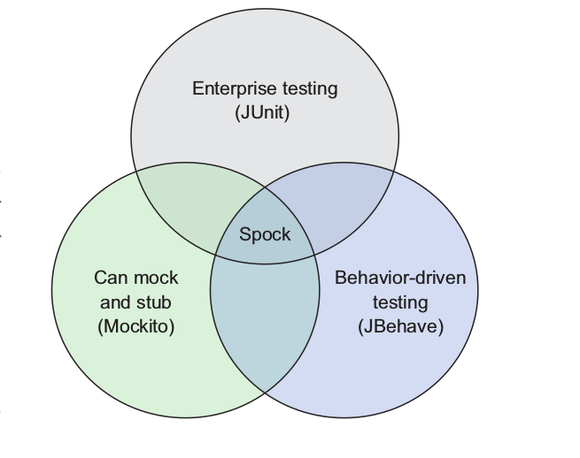

简而言之，Spock是一个更全面的用于Java(Groovy)的测试框架,之所以说Spock更加全面，
是因为Spock集合了现有的Java测试库，如上图。Spock可以让我们更容易地写出表达性更强
的测试用例。由于它内置的Junit Runner,Spock兼用大部分的IDE，测试工具，和持续集成
服务器。下面就介绍一下Spock的特性
#### Spock特性
1. 内置支持mocking stubbing，可以很容易地模拟复杂的类的行为
2. Spock实现了BDD范式(behavior-driven development)
3. 与现有的Build工具集成，可以用来测试后端代码，Web页面等等
4. 兼容性强，内置Junit Runner,可以像运行Junit 那样运行Spock，甚至可以在同一个项
   目里面同时使用两种测试框架
5. 取长补短，吸收了现有框架的优点，并加以改进
6. Spock 代码风格简短，易读，表达性强，扩展性强，还有更清晰显示bug

#### 为什么是Spock
Spock似乎有很多的好的特性，但是为什么有Junit这个那么强大的测试工具，还要去使用
Spock，甚至用Spock来代替Junit呢？（其实这个问题我也疑惑过，学完Spock我就有答案了）
下面就用一些简单的例子来解释一下
一个简单的加法

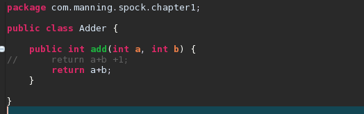

然后是Junit的测试用例

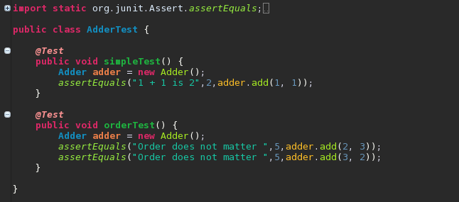

然后是Spock的测试用例

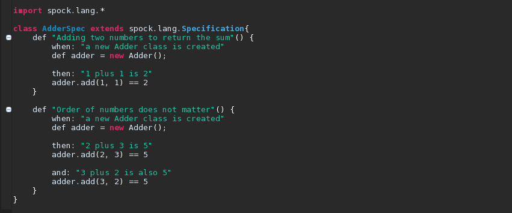

是不是觉得耳目一新呢。对比Junit的测试，Spock的测试用例，我们只要看一下函数的名字，
就可以知道这个测试是用来测试什么类的了。

让我们继续看下去，我们再写一个乘法的类，然后人为地加入一个Bug，再看看Junit和
Spock的表现

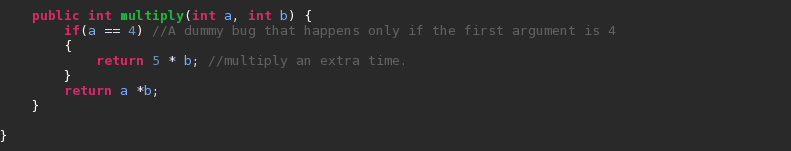

我们这次要测试Fail,看看会出现什么情况

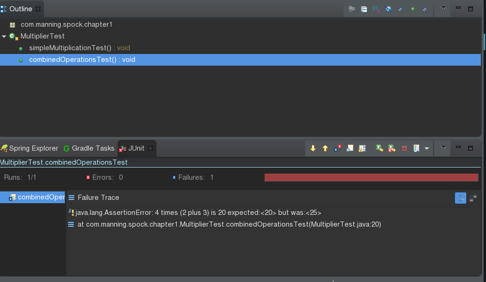


很明显，可以看出Junit是只是显示了结果不等，但是我们还是没办法判断，是加法还是乘
法出了问题，但是Spock就很清晰地给出了我们想要的答案。可以看出Spock的语法更加简
短，除此之外，Spock命名函数的方式更加接近英语的表达，只要查看函数名字我们就可以
知道测试用例的逻辑了，这只是Spock和Junit的一小
部分差异，其他的差异，会在接下来的说明中展示出来。

### Spock语法
Spock是基于Groovy,Groovy是基于JVM的脚本语言，有Java开发经验就很容易学习Groovy了
，这里就不对Groovy做详细介绍了，假设你已经掌握Groovy的基本用法了

接下来就来介绍Spock的相关语法了
##### Specification
```java
class MyFirstSpecification extend Specification{
    //fields
    //fixture methods
    //feature methods
    //helper methods
}

```
Specification是代表一个继承于**spock.lang.Specification**的一个Groovy
class.Specification的名字一般是跟系统或者业务逻辑有关的组合词，例如之前的
AdderSpec

##### Fields
```java
def obj = new ClassUnderSpecification()
def coll = new Collaborator()
```
如果你想实例化一个类，就可以像上面的代码

##### Feature Methods
```java
def "pushing an element on the stack"() {
  // blocks go here
}
```
Feature Methods就是具体写测试用例的方法了，里面包含着我们接下来会提到的Fixture
Methods 和Blocks

##### Fixture Methods
```
def setup() {}          // run before every feature method
def cleanup() {}        // run after every feature method
def setupSpec() {}     // run before the first feature method
def cleanupSpec() {}   // run after the last feature method
```
关于Fixture Methods的作用，我引用一下官方文档的一段话
>Fixture methods are responsible for setting up and cleaning up the environment in which feature methods are run. Usually it’s a good idea to use a fresh fixture for every feature method, which is what the setup() and cleanup() methods are for.
>All fixture methods are optional.

为了更好地理解 Spock的特性，引用我们更熟悉的Junit来进行比较，(图截自官网)

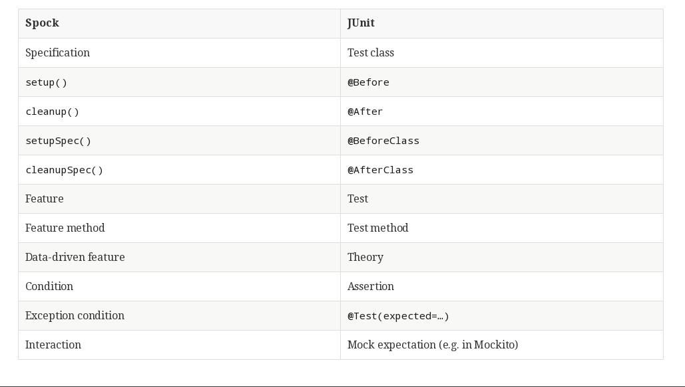

接下来，我们就要介绍Spock最与众不同的特性了

##### Blocks
引用官网的一段话
>Spock has built-in support for implementing each of the conceptual phases of a feature method. To this end, feature methods are structured into so-called blocks. Blocks start with a label, and extend to the beginning of the next block, or the end of the method. There are six kinds of blocks: setup, when, then, expect, cleanup, and where blocks

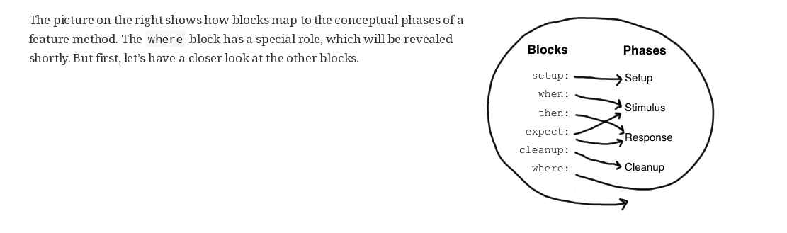

下面就了解一下不同Block的功能

###### The given:block
given:应该包含所有的初始化条件或者初始化类，例如你可以把要测试的类的实例化放在
given.总而言之，given就是放置所有单元测试开始前的准备工作的地方

###### The setup:block
setup:个人理解功能跟given 很相似，所以初始化的时候可以二选一(强烈推荐用given，因
为这样更符合BDD范式)

###### The when:blcok

when:是Spock测试中最重要的一部分，这里放置的就是你要测试的代码，和你如何测试的用
例，这里的测试代码应该尽可能地短。有经验的Spock用户可以直接看when:block就了解测
试流程了

###### The then:block

then:block包含隐式的断言，补充一下，Spock是没有 assert这个断言的函数的，Spock使
用的是assertion，个人理解成这是一种隐式的断言。概括来说，then 就是放置你预期测试
结果的地方。

现在已经把given-when-then粗略地解释了一下，可能还有点抽象，现在就来看一下代码吧
先来假设一下需求吧。假设现在要测试一个通过网站来销售电脑的电商平台，如下图(图截
自 java_test_with_spock 一书)

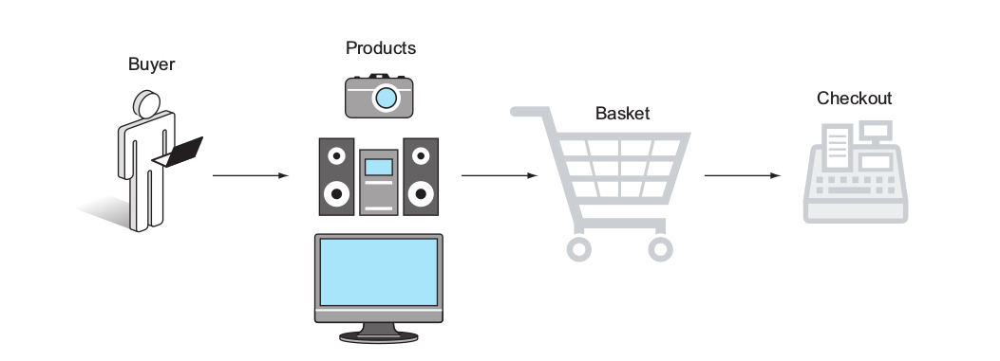

我们通过模拟用户添加商品到购物车，来展示Spock的用法
```java
public class Product{
    private String name;
    private int price;
    private int weight;
}
public class Basket{
    public void addProduct(Product product){
    addProduct(product,1)
    }
    public void addProduct(Product product,int times){
    //some code about business
    }
    public int getCurrentWeight(){
    //
    }
    public int getProductTypesCount(){
    //
    }
}
```
现在我们就来写Spock的测试用例
```java
def "A basket with one product has equal weight"(){
    given: "an empty basket and a Tv"
    Product tv=new Product(name:"bravia",price:1200,weight:18)
    Basket basket=new Basket()

    when:"user wants to buy the TV"
    basket.addProduct(tv)

    then:"basket weight is equal to the TV"
    basket.currentWeight==tv.weight
}
```
现在应该可以对Spock用一个初步的认识了。使用given-when-then就可以写一些逻辑不是非
常复杂的测试用例了。现在继续介绍

###### The and：block
and：有点奇怪，它的用法有点像语法糖，它自己本身是没有什么功能，它只是拿来扩展其
他的功能的，有点抽象，那就继续用上面的例子来解释。show you code
```java
def "A basket with one product has equal weight"(){
    given: "an empty basket "
    Basket basket=new Basket()
    and: "several products"
    Product tv=new Product(name:"bravia",price:1200,weight:18)
    Product camera=new Product(name:"panasonic",price:350,weight:2)
    Product hifi=new Product(name:"jvc",price:600,weight:5)

    when:"user wants to buy the TV abd the camera and the hifi"
    basket.addProduct(tv)
    basket.addProduct(camera)
    basket.addProduct(hifi)


    then:"basket weight is equal to all product weight"
    basket.currentWeight==(tv.weight+camera.weight+hifi.weight）
}
```
从上面的代码我们可以看到，given和and都是用来初始化类，只是将根据Basket和Product
类型进行了细分。如下图

!()[resources/and.png]

使用and block可以让我们的代码结构更加优美易懂。如果and是紧跟在when后面，那么and
就是被赋予了when block的功能，如此类推

###### The:expect block
expect是一个很强大的特性，它用很多种用法，最常用的用法就是把given-when-then都结
合起来
```java
def "An empty basket has no weight"(){
    expect:"zero weight when nothing is added"
    new Basket().currentWeight==0
}
```
或者是以下这种形式
```java
def "An empty basket has no weight(alternative)"(){
    given:"an empty basket"
    Basket basket=new Basket()
    expect:"that the weight is 0"
    basket.currentWeight==0
}
```
又或者用expect作前提条件
```java
def "A basket with two products weights as their sum (precondition)"() {
    given: "an empty basket, a TV and a camera"
    Product tv = new Product(name:"bravia",price:1200,weight:18)
    Product camera = new Product(name:"panasonic",price:350,weight:2)
    Basket basket = new Basket()

    expect:"that nothing should be inside"
    basket.currentWeight == 0
    basket.productTypesCount == 0

   /* expect: block performs
    intermediate assertions*/

    when: "user wants to buy the TV and the camera"
    basket.addProduct tv
    basket.addProduct camera

    then: "basket weight is equal to both camera and tv"
    basket.currentWeight == (tv.weight + camera.weight)
   /* then: block examines
    the final result*/
}
```
上面那个例子是在添加产品之前检查初始化条件，这种情况下，能更容易看出是哪里测试fail

###### The:clean block
clean 就相当于在所有的测试结束以后执行的操作，例如，如果我们在测试中新建了IO流，
就可以在clean里面关闭IO流，那样就可以保证代码的正确性了


#### Spock killer future

可能看了上面的例子，你会觉得Spock只是比Juni看起来好写一点，没有什么大不了的。那
么现在，就来介绍一下Spock 其中一个的killer future 。先来假设一下需求吧（例子来自
Java_test_with_spock一书），现在有一个核反应堆，这个反应堆的系统组成：
* 多个烟雾感应器(输入)
* 3个辐射感应器(输入)
* 现在的压力值(输入
* 报警器(输出)
* 疏散命令(输出)
* 通知操作员关闭反应堆(输出)
系统如图

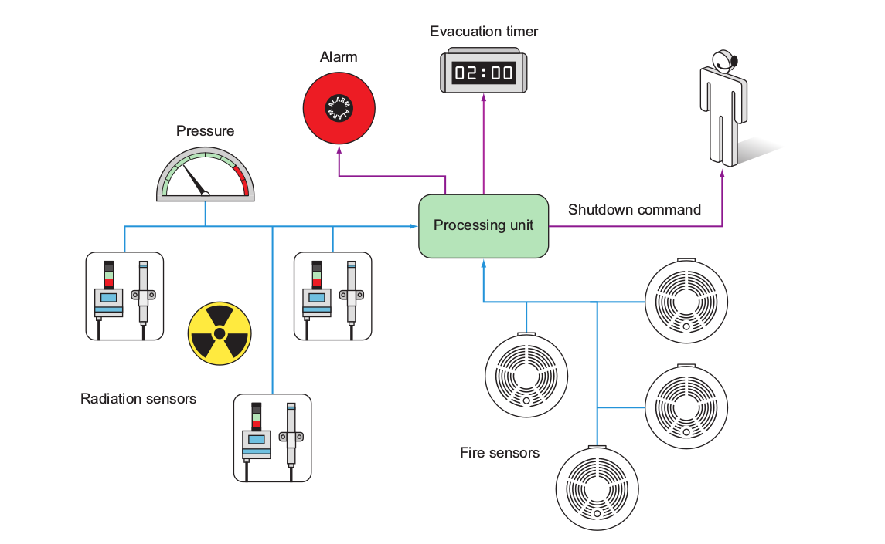

现在再来说说相关的要求吧
* 如果压力值超过150，报警器报警
* 如果2个或者更多的烟雾感应器被触发，那么报警器报警，通知操作员关闭反应堆
* 如果辐射值超过100，警报器报警，通知操作员关闭反应堆，并马上疏散人群
输入输出对应关系

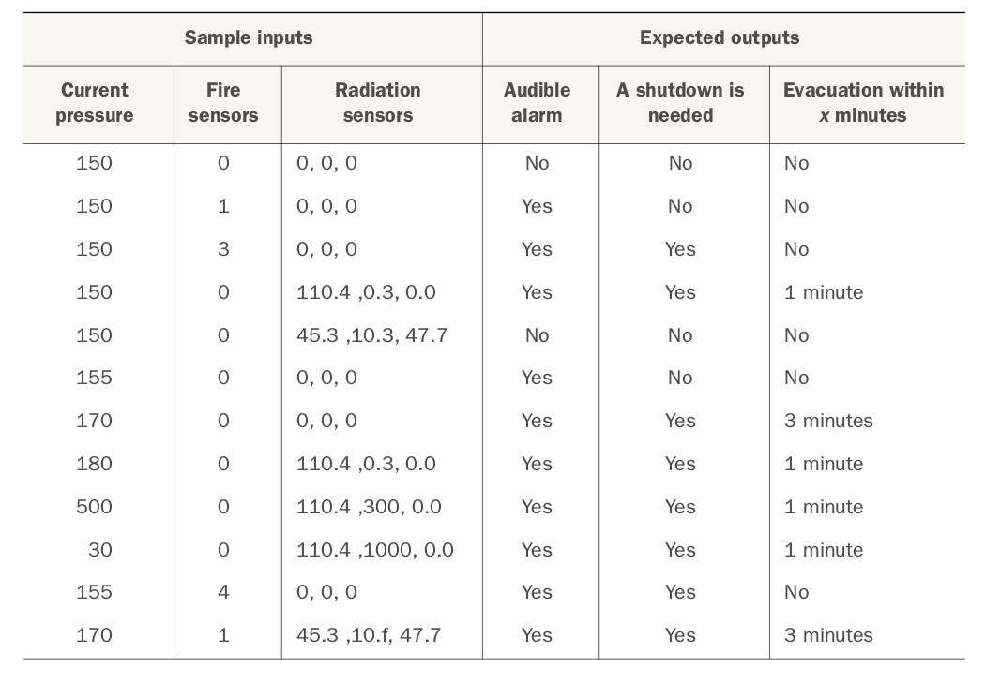

现在，假如我们用Junit来写测试用例(代码可能有点多)
```java
@RunWith(Parameterized.class)
public class NuclearReactorTest {
	private final int triggeredFireSensors;
	private final List<Float> radiationDataReadings;
	private final int pressure;

	private final boolean expectedAlarmStatus;
	private final boolean expectedShutdownCommand;
	private final int expectedMinutesToEvacuate;

	public NuclearReactorTest(int pressure, int triggeredFireSensors,
			List<Float> radiationDataReadings, boolean expectedAlarmStatus,
			boolean expectedShutdownCommand, int expectedMinutesToEvacuate) {

		this.triggeredFireSensors = triggeredFireSensors;
		this.radiationDataReadings = radiationDataReadings;
		this.pressure = pressure;
		this.expectedAlarmStatus = expectedAlarmStatus;
		this.expectedShutdownCommand = expectedShutdownCommand;
		this.expectedMinutesToEvacuate = expectedMinutesToEvacuate;

	}

	@Test
	public void nuclearReactorScenario() {
		NuclearReactorMonitor nuclearReactorMonitor = new NuclearReactorMonitor();

		nuclearReactorMonitor.feedFireSensorData(triggeredFireSensors);
		nuclearReactorMonitor.feedRadiationSensorData(radiationDataReadings);
		nuclearReactorMonitor.feedPressureInBar(pressure);
		NuclearReactorStatus status = nuclearReactorMonitor.getCurrentStatus();

		assertEquals("Expected no alarm", expectedAlarmStatus,
				status.isAlarmActive());
		assertEquals("No notifications", expectedShutdownCommand,
				status.isShutDownNeeded());
		assertEquals("No notifications", expectedMinutesToEvacuate,
				status.getEvacuationMinutes());
	}

	@Parameters
	public static Collection<Object[]> data() {
		return Arrays
				.asList(new Object[][] {
						{ 150, 0, new ArrayList<Float>(), false, false, -1 },
						{ 150, 1, new ArrayList<Float>(), true, false, -1 },
						{ 150, 3, new ArrayList<Float>(), true, true, -1 },
						{ 150, 0, Arrays.asList(110.4f, 0.3f, 0.0f), true,
								true, 1 },
						{ 150, 0, Arrays.asList(45.3f, 10.3f, 47.7f), false,
								false, -1 },
						{ 155, 0, Arrays.asList(0.0f, 0.0f, 0.0f), true, false,
								-1 },
						{ 170, 0, Arrays.asList(0.0f, 0.0f, 0.0f), true, true,
								3 },
						{ 180, 0, Arrays.asList(110.4f, 0.3f, 0.0f), true,
								true, 1 },
						{ 500, 0, Arrays.asList(110.4f, 300f, 0.0f), true,
								true, 1 },
						{ 30, 0, Arrays.asList(110.4f, 1000f, 0.0f), true,
								true, 1 },
						{ 155, 4, Arrays.asList(0.0f, 0.0f, 0.0f), true, true,
								-1 },
						{ 170, 1, Arrays.asList(45.3f, 10.3f, 47.7f), true,
								true, 3 }, });

	}

```
老实说，很丑陋。看得我都不想看了，还有更严重的问题，假如我要增加一个输入或者增加
一个输出呢，我都不敢想下去了。
这个时候，来看一下Spock的测试用例
```java
lass NuclearReactorSpec extends spock.lang.Specification{

	def "Complete test of all nuclear scenarios"() {
		given: "a nuclear reactor and sensor data"
		NuclearReactorMonitor nuclearReactorMonitor =new NuclearReactorMonitor()

		when: "we examine the sensor data"
		nuclearReactorMonitor.feedFireSensorData(fireSensors)
		nuclearReactorMonitor.feedRadiationSensorData(radiation)
		nuclearReactorMonitor.feedPressureInBar(pressure)
		NuclearReactorStatus status = nuclearReactorMonitor.getCurrentStatus()

		then: "we act according to safety requirements"
		status.alarmActive == alarm
		status.shutDownNeeded == shutDown
		status.evacuationMinutes == evacuation

		where: "possible nuclear incidents are:"
		pressure | fireSensors | radiation             || alarm | shutDown | evacuation
		150      | 0           | []                    || false | false    | -1
		150      | 1           | []                    || true  | false    | -1
		150      | 3           | []                    || true  | true     | -1
		150      | 0           | [110.4f ,0.3f, 0.0f]  || true  | true     | 1
		150      | 0           | [45.3f ,10.3f, 47.7f] || false | false    | -1
		155      | 0           | [0.0f ,0.0f, 0.0f]    || true  | false    | -1
		170      | 0           | [0.0f ,0.0f, 0.0f]    || true  | true     | 3
		180      | 0           | [110.4f ,0.3f, 0.0f]  || true  | true     | 1
		500      | 0           | [110.4f ,300f, 0.0f]  || true  | true     | 1
		30       | 0           | [110.4f ,1000f, 0.0f] || true  | true     | 1
		155      | 4           | [0.0f ,0.0f, 0.0f]    || true  | true     | -1
		170      | 1           | [45.3f ,10.3f, 47.7f] || true  | true     | 3
	}

}
```
除了看到我们熟悉的given-when-then范式外，似乎还多了一个之前没见过的where block。
现在就来看一下Spock测试用例的优美之处，我们看到Spock的参数都用类似表格的东西放置
好了(这是Spock的Parameterized tests)，在**||**左边的是输入，右边的输出，每一列开
始都是该参数的属性名，我们就可以在**then**里面放置我们期待的输入对应的输出的代码
逻辑，然后在where里面添入具体的参数，一目了然，要新增参数也很容易实现，只要在表
格最下面一行增加，然后填上我们期待的输出。是不是很强大呢？

#### 结语
Spock还有很多很强大的功能，例如内置的Mocking Stubbing,还有支持企业级应用，
Spring,Spring boot,和Rest service 测试。更多的内容，推荐阅读《java test with
spock》一书和Spock官方手册
