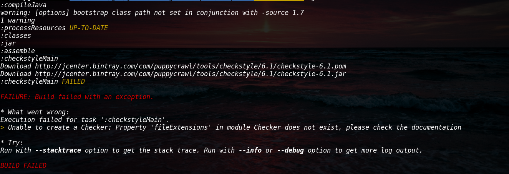
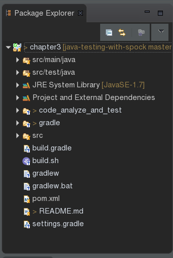

## JAVA Build
记得在学Gradle 之前，我问过这个问题，为什么我有IDE了，还要用Ant Maven或者现在要学的Gradle呢，IDE按一下按钮就可以build 完啦，为此我去stackoverflow上面搜索过这个问题，记得排名最高的回答是这样的:
1. 你使用的是Eclipse，但是如果你同事使用的是Idea或者Netbean呢？
2. 你如何保证你的Eclipse的设置不会跟别人的设置有差别，而导致build出来的结果不同?
3. 如果你想要自动完成build ,jar,static code analysis ,run unit test ,generate documentation,copy to some directory,deploy这么多的工作，IDE能一键完成么
4. 如果在持续集成环境，你想定时地去build 或者每次改了代码都build，或者在跑一次上面的流程，IDE可以做到么

这就是stackoverflow上面的回答，听着是很有道理，然后还是没有什么感觉，不管了，先用着先吧。不过，不久以后，我对build 就有了深刻的体会(切肤之痛...).


我用Gradle build checksytle(下面会提到)，然后我去github上面把谷歌的java风格的配置文件拿了过来，然后...报错了
。我把问题在谷歌搜索了一遍，在github上面看到一条issue


这个功能还没出.....好吧，我只好拿着下面的那个google-java-style来用了，然后


又来了新问题了。话说这个功能是6.3出的，问题是2015年的，那么我去指定一个新的版本不就行了么...然后欣喜若狂地去改gradle的配置，然后


这又是什么....照旧，Google一下，


运气真的是好到...什么bug都踩到了；顺便贴上一张在Travis-Ci的Error


JDK的版本的问题都来了。
所以，真的是血淋淋的教训(我的血)，用build tool可以解决这些问题，只要我指定了相应的正确的问题，那么无论你用的是什么环境，都不会用问题。这个时候，或许你会问，那么如果build tool 出现版本问题呢，那应该怎么解决呢？同理可得嘛：指定一个正确的版本，那就不用担心了，这个时候登场的就是Gradle wrapper，通过wrapper我们就可以指定Gradle的版本，然后用gradlew 命令运行，就可以解决gradle 的版本问题了

## JAVA的自动化检测
### java代码风格检查和潜在bug分析
首先先来介绍一下代码风格检查和bug分析所用到的工具

* checksytle
* pmd
* findbug

##### checkstyle
> Checkstyle is a development tool to help programmers write Java code that adheres to a coding standard. It automates the process of checking Java code to spare humans of this boring (but important) task. This makes it ideal for projects that want to enforce a coding standard.

我就引用以下checkstyle 文档里面的这句话了，checkstyle就是为了让程序猿写出符合规范的代码的，用工具来代替人工检查。
刚刚提到了规范，那么 规范是什么呢.比较流行的是Sun的代码规范或者是Google的代码规范

[Sun Code Conventions](http://www.oracle.com/technetwork/java/javase/documentation/codeconvtoc-136057.html)

[Google Java Style](http://checkstyle.sourceforge.net/reports/google-java-style.html)

我们使用的是Google 的风格,如果对checksytle感兴趣的，可以去查看一下[CheckStyle官网](http://checkstyle.sourceforge.net/)
##### pmd
pmd 是在源代码级别进行分析的代码分析器，支持多种语言，还包括一种叫CPD(copy-paste-detector)的特性，CPD就是找出那些
重复的代码(即直接在一份代码上面Copy，然Paste到另外的项目里面)，CPD还有很多自定义的选项。
更多的特性，可以在[Pmd的在线文档](https://pmd.github.io/pmd-5.5.1/index.html)上面找到

##### fingbug
findbugs是基于字节码级别的静态代码分析工具,这个是findbugs的[官网](http://findbugs.sourceforge.net/)

pmd 和findbug都是代码分析工具，那么究竟他们有什么差异和优点呢？
其实，就功能而言，二者是互补的。正如我上面提到的pmd 是源代码级别的代码分析器，它就能找到一些没有大括号，不正确的
空指针检查，不必要的构造方法，还有忘记在switch添加break之类的错误
findbug是工作在字节码级别的，所以它就能做到一些pmd力所不及的工作，例如clone()方法可能返回空值，不正确的类型转换，
一个死循环，总是返回true的equal()方法等等

所以，通常情况下，findbug和pmd是找到不同类型的问题的，如果配合着来使用，效果会更佳。

现在就来说说这几个工具怎么用吧，把我这个[resources/code_analyze_and_test](code_analyze_and_test)文件夹拷到你的项目根目录下，然后在你的build.gradle 文件里面加上下面两句代码


```
apply from: 'code_analyze_and_test/code_analyzer.gradle'
apply from: 'code_analyze_and_test/code_unit_test.gradle'
```
如图


然后在终端运行
```
gradle clean

```
```
gradle wrapper

```
```
./gradlew build

```
这里记得不要用**gradle build**,会出现版本问题的
