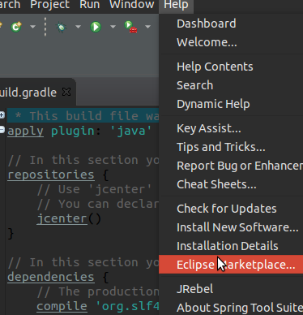

## Setup check style tool and source code analyzer with Gradle
#### 1. install Gradle plugin
open Eclipse,click "Help" in top menu bar



and type "Gradle" in the search area,then press Enter,hence,you will see the plugin as below,which is official Gradle support for Eclipse,and install it


#### 2. install checkStyle plugin

search "checkstyle" in the Eclipse Marketplace as same as what shows above,and just install it


#### 3. install pmd plugin
as same as what shows above.


#### 4. install findbugs plugin

as same as what shows above except name of the plugin


#### 5.set up to build
it seems the preparation is done,can not wait to start build.so firstly create a new directory and start STS using the newly created directory as its workspace directory.


then,select a wizard


click next button,and go ahead,


click finish button.
After everything is done ,the Package Explorer looks like this


Note that Gradle is as same as Maven in a way,which follows the convention over configuration paradigm by supporting sensible
default configuration for your project as well as a standardized build lifecycle.it means that sepecific directory is for specific purpose.This is default layout of Gradle which i find in the Gradle official website


Open the build.gradle file,it looks like that originally


in order to intergrate checkstyle ,pmd,findbugs plugin with Gradle,you should add this in your build.gradle
```
apply plugin: 'maven'
apply plugin: "checkstyle"
apply plugin: "pmd"
apply plugin: "findbugs"
repositories {
      mavenLocal()
      mavenCentral()
}dependencies {
    checkstyle group:  'com.puppycrawl.tools',name: 'checkstyle',version:'6.15'

}checkstyle{
    /*source = fileTree('src')*/
    ignoreFailures = true
    sourceSets = [sourceSets.main]
    ignoreFailures = true
}
pmd  {
    ignoreFailures=true
    ruleSets=[
            /*'Java-android',*/
            'java-basic',
            'java-braces',
            'java-clone',
            'java-codesize',
            //'java-comments',
            'java-controversial',
            'java-coupling',
            'java-design',
            'java-empty',
            'java-finalizers',
            'java-imports',
            'java-j2ee',
            'java-javabeans',
            'java-junit',
            'java-logging-jakarta-commons',
            'java-logging-java',
            'java-migrating',
            'java-naming',
            'java-optimizations',
            'java-strictexception',
            'java-strings',
            'java-sunsecure',
            'java-typeresolution',
            'java-unnecessary',
            'java-unusedcode'
    ]
    /*source = fileTree('src')*/
    ignoreFailures = true
    sourceSets = [sourceSets.main]
}
 findbugs {
    /*toolVersion = "3.0.1"*/
    sourceSets = [sourceSets.main]
    ignoreFailures = true
    /*reportsDir = file("$project.buildDir/findbugsReports")*/
    effort = "max"
    reportLevel = "medium"
    /*visitors = ["FindSqlInjection", "SwitchFallthrough"]*/
    /*omitVisitors = ["FindNonShortCircuit"]*/
    /*includeFilter = file("$rootProject.projectDir/config/findbugs/includeFilter.xml")*/
    /*excludeFilter = file("$rootProject.projectDir/config/findbugs/excludeFilter.xml")*/
    /*excludeBugsFilter = file("$rootProject.projectDir/config/findbugs/excludeBugsFilter.xml")*/
}tasks.withType(FindBugs) {
    reports {
        xml.enabled false
        html.enabled true
        /*html.stylesheet resources.text.fromFile('config/xsl/findbugs-custom.xsl')*/
        html {
          destination "build/reports/findbugs/findbugs.html"
        }
    }
}
```
this is a customized configuration that "tells" gradle how to build you project
then,you build.gradle file looks like above


last but not least,create a new directory named 'config' in the  rootProject,then create a new directory named 'checkstyle' in config,and add a file named checkstyle.xml [checkstyle.xml](resources/checkstyle.xml) which is the code guide file
for checkstyle  .when everything finish ,it looks like below.


Finally,everything is done,time to build the project ,open the Terminal ,and go to your rootProject,and type
```
gradle build
```

in your terminal,and enjoy the build.
Note that if the terminal shows that "bash: command not found:gradle",which means that you haven't install gradle,so just install it in your computer before your build.
[Gradle](https://gradle.org/),follow the offical site document,you could install it smoothly
