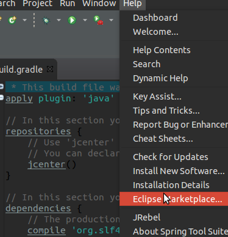
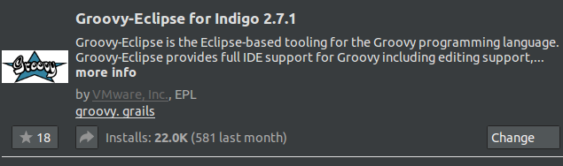
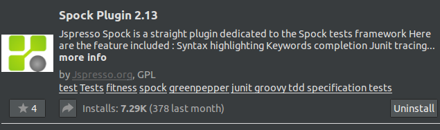
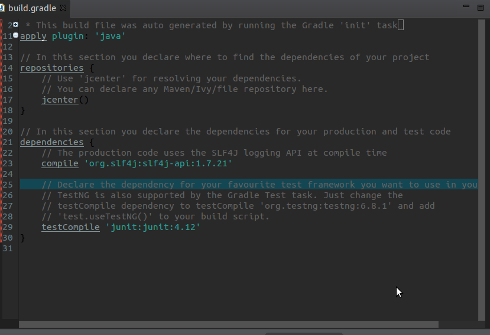
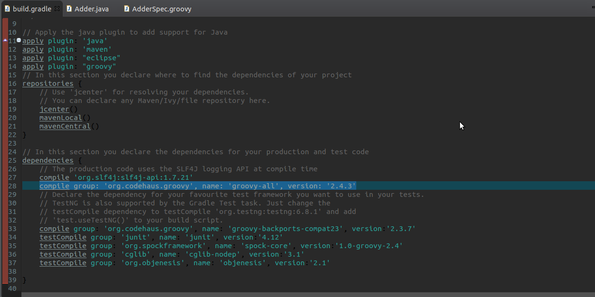
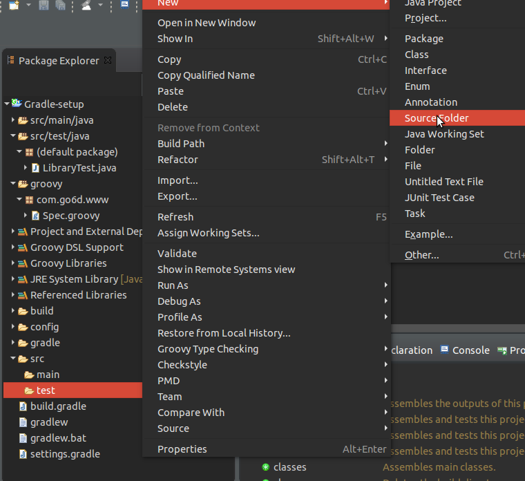
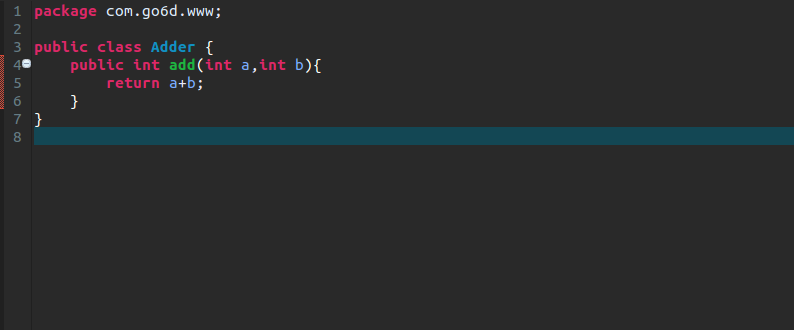
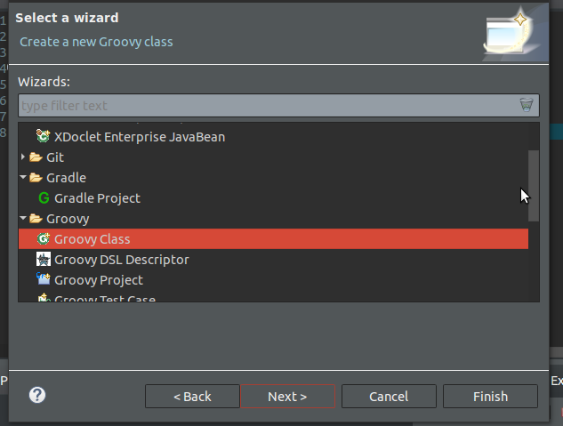
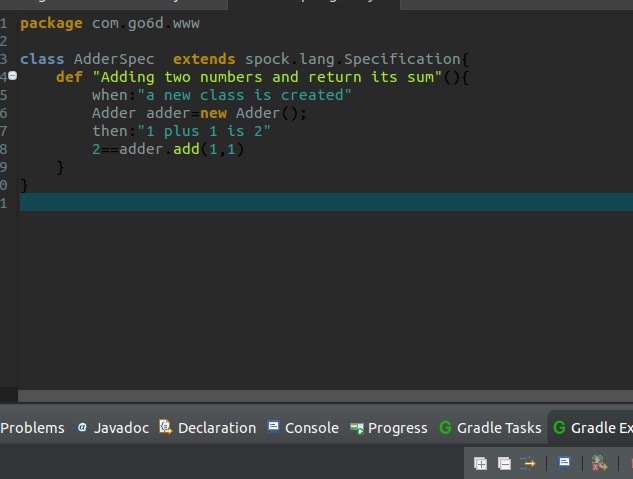

### Set up Spock With Gradle
for that Spock is a testing and specification framework for Java and Groovy applications,which is based on Groovy.Thus,first of all,you should install some plugins in Eclipse

#### 1.Install plugins
Open Eclipse,and click "Help" in top menu bar



and type "Groovy" in the search text area,press Enter,you could see



continues to install "Spock" plugin,like this(edit:i have installed it,so it shows uninstall)



Now ,the job of installing plugins is done,but we still have to do some preparation.

#### 2.Edit your build.gradle
the original build.gradle file looks like:



and add the following code to your build.gradle file
```
apply plugin: 'maven'
apply plugin: 'eclipse'
repositories {
  mavenLocal()
  mavenCentral()
}
dependencies {
    compile group: 'org.codehaus.groovy', name: 'groovy-all', version: '2.4.3'
    compile group: 'org.codehaus.groovy', name: 'groovy-backports-compat23', version:'2.3.7'
    testCompile group: 'org.spockframework', name: 'spock-core', version:'1.0-groovy-2.4'
    testCompile group: 'cglib', name: 'cglib-nodep', version:'3.1'
    testCompile group: 'org.objenesis', name: 'objenesis', version:'2.1'
}
```
after all ,it looks like :



Note that we all know in maven,if we write some dependencies in the pom.xml,and save pom.xml,then eclipse will help us to automatically downloan dependencies,however,in Eclipse,Gradle seems is unable to automatically to handle dependencies(at least i haven't find it,if anyone know how to,please feel free to tell me).Instead , we could downloan dependencies manually
,after typing dependencies in  the build gradle ,then we type
```
gradle eclipse
```
in the terminal when your working directory is the rootProject.
#### Time to Write Test with Spockframework
Firstly,create a new source folder named "groovy" in the test direstory according "convention over configration paradigm "



create a new java class named Adder in "src/main/java" directory



and create a new groovy class named AdderSpec in "src/test/groovy"



and the context of groovy class like this:



How do you run this test? You run it in the same way as a JUnit test! Again, right-click the Groovy class and choose Run As JUnit Test from the pop-up menu. The result in Eclipse is shown
