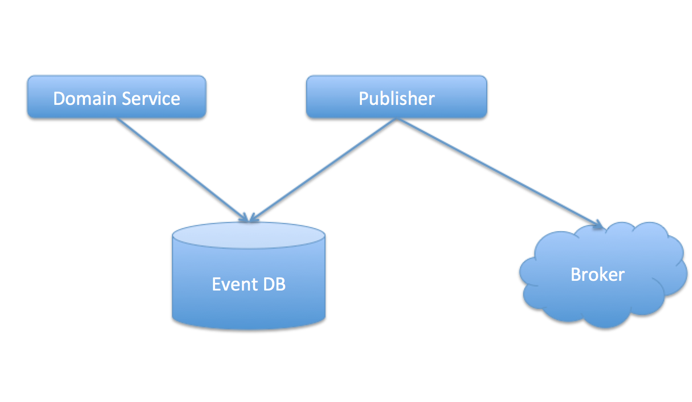
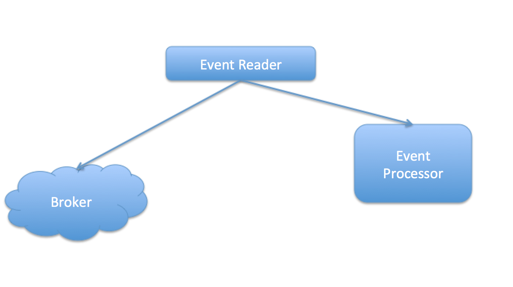

# 1. Description
The design of the event system.

# 2. Event body
Use Json as event body and the schema of the event body:
```java
{
  "id": "event id", // NOT NULL
  "createTime": long, //NOT NULL
  "expire": long,
  "sequenceNumber":long,
  "data": "json string" // JSON DATA
}
```

# 3. Event Producer
Event producer contains three part: `event creator`, `event db`, `event publisher`

## 3.1 Event creator
Event created by domain services, and save it to event database. The `event create` and `domain service` should be in one transaction.

## 3.2 Event database
The schema:
```Java
  id; //UUID NOT NULL
  createTime; // create time, NOT NULL
  expire; //expire time
  version; //version of the event, NOT NULL
  status; // status of event: pending, created, NOT NULL
  data; //the real data of the event
```

## 3.3 Event producer
The event producer read events from `event db`, and publish them to event borker.

### 3.3.1 How to Read events
Read Event whose status is created, or status is pending but already expired. When read status that is created, then change it's status to pending.
### 3.3.2 How to publish
Publish events to broker, publish a batch of events or just one.
### 3.3.3 How to delete event
After publish sucessed, then delete the event from the event db.

## 3.4 How to start
The producer will start when the service start, each micro-service constains an event producer.

## 3.5 Work flow
- domain service create event, and save the event to event db.
- the producer read event from db, and then publish it to broker.
- After publish success, delete the event from db.


## 3.6 How to add create producer
This section shows how to create a producer in micro service.
### 3.6.1 Define the event
Different service produce different events. So the first step is define the events that this service may produced.
For example, `customer-authentication` service may produce `SignInEvent`:
```Java

  /**
   * customer id.
   */
  private String customerId;

  /**
   * anonymous id.
   */
  private String anonymousId;
```
### 3.6.2 Define the topics
Different broker has different way to create topic.
For now, we use google's pub/sub, so fellow this doc: [google pub/sub](https://cloud.google.com/pubsub/docs/)
### 3.6.3 Define the event entity
When some thing happened, then the somain service produce a event and save it to database.
Each micro service only have one event entity(Save all event to one table), or have many different event entity. Use one event entity is suggested, because we use the common `message` to publish our events.
For `customer-authentication` service, the event entity is:
```Java
public class EventMessage {

  private String id;

  private long createdAt;

  private String sequenceNumber;

  private long expire;

  private Integer version;

  private String payload;

  // Which topic this event blong to.
  private String topic;

  // Event status, CREATED if waiting for publish, PENDING is being publish.
  private EventStatus status;
}
```
### 3.6.4 Define the event creator
For some business actions, they may produce some event. so create the event when the action triggered.
**Make sure that the business action and the action for create event are in one transaction.**
Create event action is create an event and save it to database.

### 3.6.5 Publish the event to event bus
Event publisher is a service that circulate running. Since we used springboot, so we can use the `Scheduled Job` for this service.
#### 3.6.5.1 Create the scheduled job
Scheduled job call the publisher to publish the event to event bus.
In springboot, we can use `Scheduled Job`:
- first, add `@EnableScheduling` to the `Application` class
- second, create a service, and add `@Scheduled(fixedRate = 200)` to one of the functions in this service. fixedRate means the function will executes each 200 ms. For example:
```java
@Service
public class EventPublisher {
  @Scheduled(fixedRate = 200)
  public void executor() {
    // do the publish action
  }
}
```
#### 3.6.5.2 Create the publisher client with `message-client` lib
Message-client lib is the lib we used to publish message to event bus.
- first, inport the dependency, see README of `message-client`
- second, create the producer.
For now, we use google's pub/sub, so use this to create the producer client:
```java
Producer producer = DefaultProducerFactory.createGoogleProducer(`projectId`, `topicName`);
```
As we may got several topic, so we need to create the same number of producer.
#### 3.6.5.3 publish the event to event bus
publish the event to event bus, then the producer's work is done.
- first, fetch the events from db, and change their status to `PENDING`. or fetch those event whose status is `PENDING`, but created long time ago(maybe one minute ago).
- second, create messages with those events.
- third, publish those messages to event bus.


# 4. Event Consumer
Event consumer contains two part: `receiver`, `processor`, `manager`
## 4.1 Receiver
Event Receiver receive or fetch events from broker.
## 4.2 Processor
All Processor have the same entrance, and handle the event. and event.
## 4.3 Manager
Manager is the control center of consumer, it call reader to fetch events from broker, and then call the processor.
## 4.4 How to start
The consumer will start when the service start.
## 4.5 How to subscribe topic
When the consumer start, then send a subscribe action to broker. The topic is configurable.
## 4.6 Work flow
- Event reader fetch events from broker.
- Call processor to process the events.


## 4.7 How to add consumer
This section shows how to create a consumer in micro service.
### 4.7.1 Create a subscripber for a topic
Create a subscriber for a topic, so that we can receive event messages from the topic.
For now, we use google's pub/sub, so see the doc. [google pub/sub](https://cloud.google.com/pubsub/docs/)
### 4.7.2 Create the event model
Each topic contains a kind of event, and get the event model schema from producer, and create the model.
### 4.7.3 Create consumer
Event consumer  is a service that circulate running. Since we used springboot, so we can use the `Scheduled Job` for this service.
#### 4.7.3.1 Create a circulate running service.
#### 4.7.3.2 Create a consumer client with `message-client` lib
For now, use google's pubsub consumer:
```java
  Consumer consumer = DefaultConsumerFactory.createGoogleConsumer(projectId, subscriberId)
```
#### 4.7.3.3 Fetch event messages
For now, we use pull:
```java
  List<Message> events = consumer.pullMessages(10);
```
#### 4.7.3.4 Process messages
Process the message with detail actions.
**Make sure that the process action is idempotent**

#### 4.7.3.5 Acknowledge the broker 
Acknowledge the borker that the message has been processed, so that the message will not be received again.
And for now, the consumer's work is done