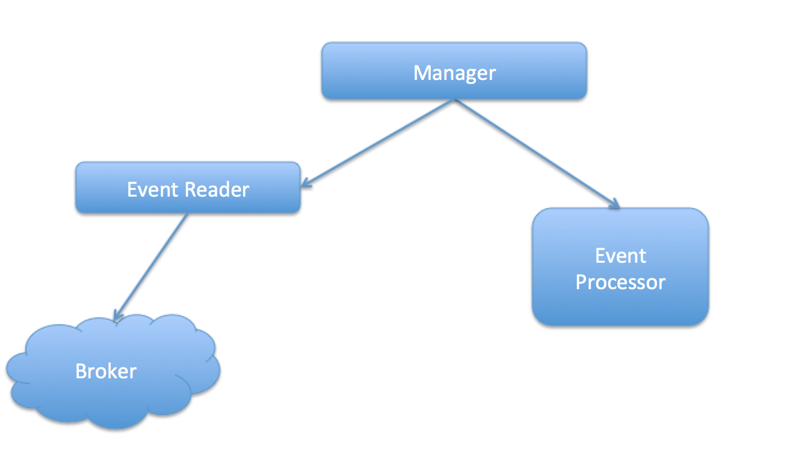

# 1. Description
The design of the event system.

# 2. Event body
Use Json as event body and the schema of the event body:
```java
{
  "id": "event id", // NOT NULL
  "createTime": long, //NOT NULL
  "expire": long,
  "sequenceNumber":long,
  "data": "json string" // JSON DATA
}
```

# 3. Event Producer
Event producer contains three part: `event creator`, `event db`, `event publisher`

## 3.1 Event creator
Event created by domain services, and save it to event database. The `event create` and `domain service` should be in one transaction.

## 3.2 Event database
The schema:
```Java
  id; //UUID NOT NULL
  createTime; // create time, NOT NULL
  expire; //expire time
  version; //version of the event, NOT NULL
  status; // status of event: pending, created, NOT NULL
  data; //the real data of the event
```

## 3.3 Event publisher
The event producer read events from `event db`, and publish them to event borker.

### 3.3.1 How to Read events
Read status whos staus is created, or status is pending but already expired.
### 3.3.2 How to publish
Publish events to broker, publish a batch of events or just one.
### 3.3.3 How to delete event
After publish sucessed, then delete the event from the event db.

## 3.4 How to start
The producer will start when the service start, each micro-service constains an event producer.

## 3.5 Work flow
- domain service create event, and save the event to event db.
- the producer read event from db, and then publish it to broker.
- After publish success, delete the event from db.


# 4. Event Consumer
Event consumer contains two part: `receiver`, `processor`, `manager`
## 4.1 Receiver
Event Receiver receive or fetch events from broker.
## 4.2 Processor
All Processor have the same entrance, and handle the event. and event.
## 4.3 Manager
Manager is the control center of consumer, it call reader to fetch events from broker, and then call the processor.
## 4.4 How to start
The consumer will start when the service start.
## 4.5 How to subscribe topic
When the consumer start, then send a subscribe action to broker. The topic is configurable.
## 4.6 Work flow
- Event reader fetch events from broker.
- Call processor to process the events.
