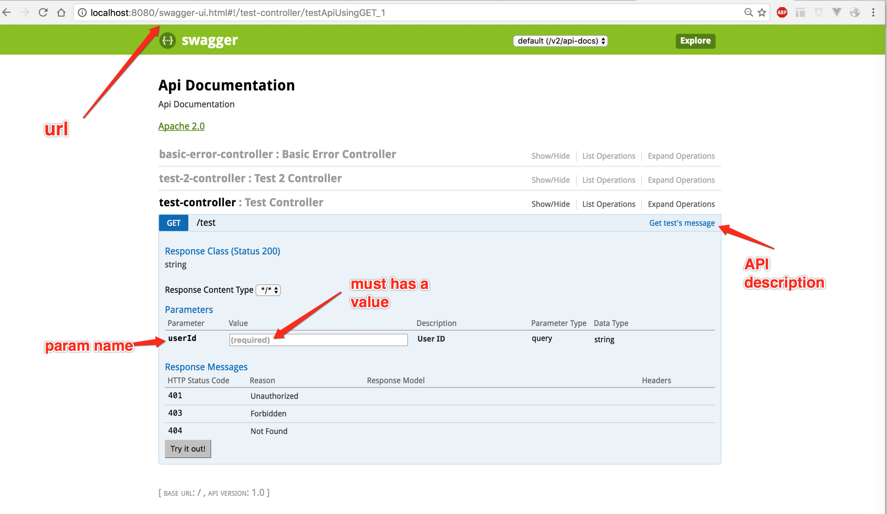
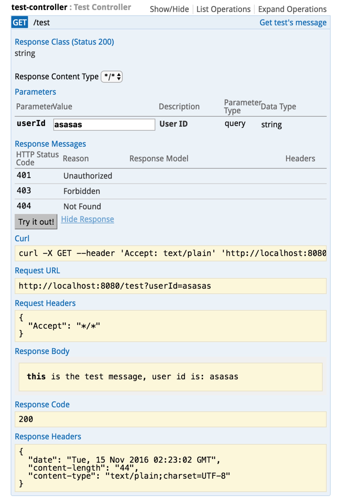

# All our service will be expose as REST API
Here show the simple process of how to work with with REST API.

## How to define REST API
1. Fellow the rest standard
2. using plural
```
/customers/{id}/age
```
3. Using http method as verb
```
get for get resources
post for create resources
put for update resources
delete for delete resources
etc...
```
4. using model for response as more as possible

## Use swagger-ui to show api doc
1. add swagger dependencies
```
  compile("io.springfox:springfox-swagger2:2.6.1")
  compile("io.springfox:springfox-swagger-ui:2.6.1")

```
2. add `EnableSwagger2` to application

```
@EnableSwagger2
@SpringBootApplication
public class Application {
  public static void main(String[] args) {
    SpringApplication.run(Application.class, args);
  }
}
```
3. add `ApiOperation`,`ApiParam` to API for comment

```
  @ApiOperation(value = "Get test's message")
  @GetMapping(Router.TEST_API)
  public String testApi(
  @RequestParam("userId") @ApiParam(value = "User ID", required = true) @NotNull String userId
  ){
    return "this is the test message, user id is: " + userId;
  }
```
then run the application, and you can see like this


## Use swagger to test the rest api


