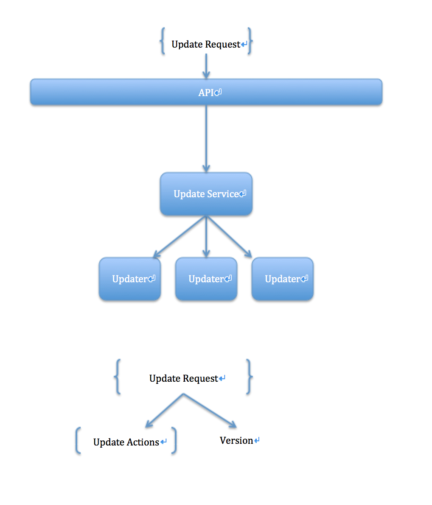

# Introduction
This doc introduce how we design update function in each  micro-service

# The Definition

## UpdateAction

All action should implement the same interface `UpdateAction`, and implement the `getActionName` function to return the function, and in the interface, we need to set the `JsonSubTypes`, like:
```java
@JsonTypeInfo(use = JsonTypeInfo.Id.NAME, include = JsonTypeInfo.As.PROPERTY, property =
    "action")
@JsonSubTypes( {
    @JsonSubTypes.Type(value = AddLineItem.class, name = CartUpdateActionUtils.ADD_LINE_ITEM)
})
public interface UpdateAction {
  /**
   * get action name.
   *
   * @return
   */
  String getActionName();
}
```
`AddLineItem` is the Action, and the `name = CartUpdateActionUtils.ADD_LINE_ITEM` should be the same with the return of function `getActionName`, like:
```java
/**
 * add line item.
 */
@Data
public class AddLineItem implements UpdateAction, Serializable {

  /**
   * auto generated serial version.
   */
  private static final long serialVersionUID = -2146127477975618855L;

  /**
   * product id.
   */
  @NotNull
  private String productId;

  /**
   * variant id.
   */
  @NotNull
  private Integer variantId;

  /**
   * quantity.
   */
  @NotNull
  @Min(1)
  private Integer quantity;

  /**
   * get action name.
   *
   * @return
   */
  @Override
  public String getActionName() {
    return CartUpdateActionUtils.ADD_LINE_ITEM;
  }
}
```

## UpdateRequest

UpdateRequest is a collection of action and version, and we used it to pass data to the api. All UpdateRequest should keep the same:
```java
public class UpdateRequest {
  /**
   * The expected version of the category on which the changes should be applied.
   * If the expected version does not match the actual version, a 409 Conflict will be returned.
   */
  @NotNull
  @Min(0)
  private Integer version;

  /**
   * Array of UpdateAction.
   * The list of update action to be performed on the category.
   * Required.
   */
  @NotNull
  @Valid
  private List<UpdateAction> actions;

  ......getter, setter......
}
```

## Updater

Updater is the real service for each action, we find the specific service by action name, so we need to name the service bean name, the service should like this:
```java
@Service(value = CartUpdateActionUtils.ADD_LINE_ITEM)
public class AddLineItemService implements Updater<Cart, UpdateAction> {

  /
  @Override
  public void handle(Cart cart, UpdateAction action) {
   ......
  }
  ......
}
```
All Updater service should implement Updater, and the first type is the `entity` for update, the second should be `UpdateAction`.
The Interface `Updater` is defined in commons lib.

## UpdateService
UpdateService is the updater executor. It also be a special `Updater`

# The Full Image:


