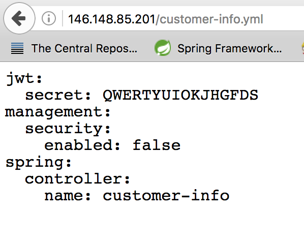

# Run E-Commerce-Cloud on Kubernetes

## 1. Introduce

TODO 

## 2. Preconditions
when I write this document when I am using:

1. OS X 10.11.3
2. google cloud sdk 146.0.0
3. kubectl v1.5.3

before run anything, you should confirm you install `gcloud` and `kubectl`, and config correctly.
[here](https://github.com/reactivesw/development_process/blob/master/devops/gke%20setup.md) is a doc for install and config then.

## 3. config k8s secrets

using the following command to config k8s secret

`kubectl create -f secrets/secrets.yaml`

this file is a secret file, would not push to github.

`secrets.yaml` template:

```yaml
apiVersion: v1
kind: Secret
metadata:
  name: reactivesw-secret
type: Opaque
data:
  github.username: 
  github.password: 
  jwt.secret: 
  postgres.username: 
  postgres.password: 
```
all data should encode by base64

## 4. add postgres

1. create deployment and service

`kubectl create -f postgres/pg-loadbalancer.yaml`

in file `pg-loadbalancer.yaml`, set postgres password to be `root`.

2. connect to postgres by local psql

```shell
kubectl get service pg-data # get service ip address and find address is 104.154.128.0
psql -h 104.154.128.0 -p 5432 -U postgres # use psql to connect and input password 
```

3. create database

after connecting to postgres on k8s, use following command to create databases for each micro-service.

```shell
create database cart;
create database category;
create database customer_authentication;
create database customer_info;
create database inventory;
create database orders;
create database payment;
create database product;
create database product_type;
```

## 5. add spring cloud config

this service uses github repo, the address is 
`https://github.com/reactivesw/config-files`

use following command to create spring cloud config service

```shell
kubectl create -f config/k8s_deployment.yaml #create deployment
kubectl create -f config/k8s_service.yaml #create service
```

after service setup, get service external endpoint and visit the address:

`{external endpoint}/customer-info.yaml`

service setup success if you get customer info config like following image:



## 6. add e-commerce applications

### 6.1 cart

use following command to create each micro-service:

```shell
kubectl create -f cart/k8s.yaml
kubectl create -f category/k8s.yaml
kubectl create -f customer-authentication/k8s.yaml
kubectl create -f customer-info/k8s.yaml
kubectl create -f inventory/k8s.yaml
kubectl create -f order/k8s.yaml
kubectl create -f payment/k8s.yaml
kubectl create -f product/k8s.yaml
kubectl create -f producttype/k8s.yaml
```

## 7. add api-gateway service

use following command to config ingresses:

`kubectl create -f api-gateway/k8s.yaml`

after setup, use following command to find ingress config:

`kubectl get service api-gateway`

and you should get like this:
>
NAME          CLUSTER-IP   EXTERNAL-IP     PORT(S)        AGE
api-gateway   10.3.248.5   35.184.19.183   80:30000/TCP   20m
>

visit each micro-service swagger page by external ip and service path:

```
http://{EXTERNAL-IP}/carts/swagger-ui.html
http://{EXTERNAL-IP}/categories/swagger-ui.html
......
```