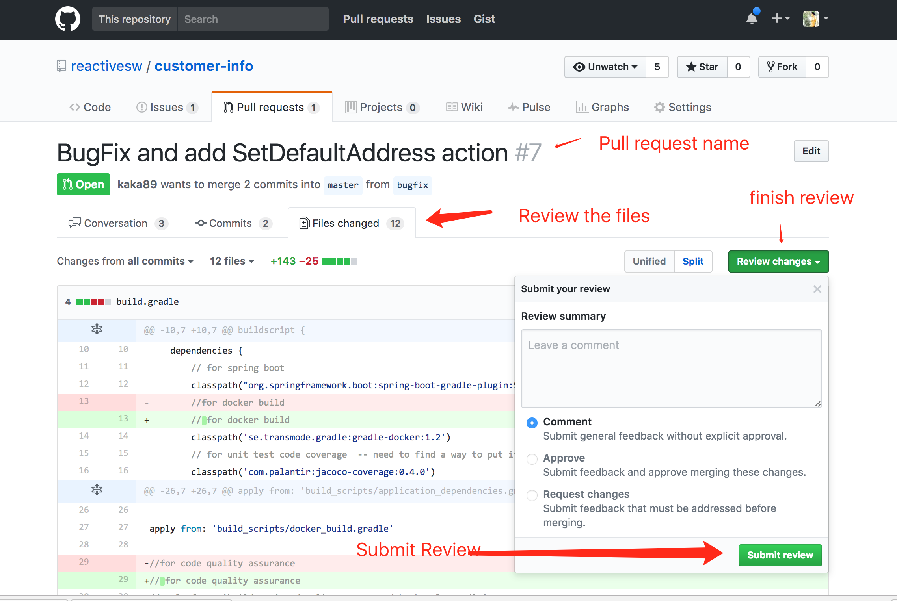
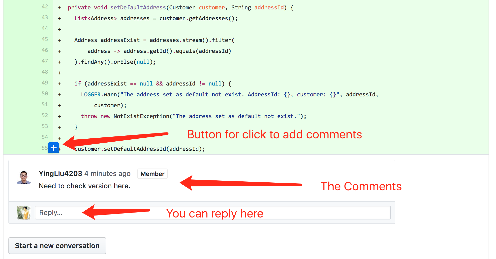

### Use pull request to push & merge changes to release branch or master

### Each repo has at least one owner, the owner take the responsibility to review & merge pull request. if the own created a pull request, then there must has one team member to review it before merge.

### How To start and finish review

### How to leave comments

